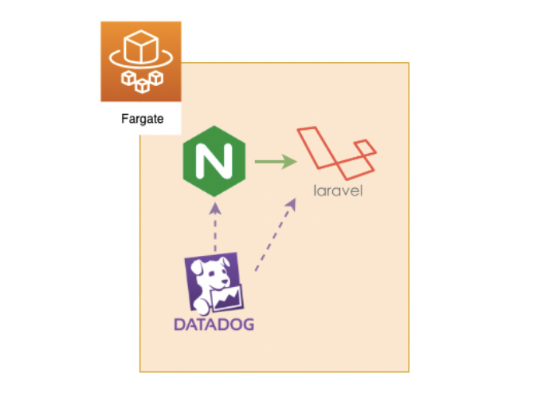

## ECS Fargate上でDatadogを動かす
DatadogをECS Fargate で動かす場合はサイドカーとして動かします。  

!!! note "サイドカーとは"
    復数のコンテナを1つのグループとして協調して動かすことをサイドカーと呼びます。  
    乗り物のバイクのサイドカーのように、復数を一緒に動かすことから来ました。

## ParameterStoreへDatadog APIキーの登録
前の章で使用したDatadog APIキーを使いまわします。  
プロダクション環境では誰がどのAPIキーを使っているかわからなってしまうので都度発行しましょう。

[https://app.datadoghq.com/account/settings#api](https://app.datadoghq.com/account/settings#api) から先程作成したAPIキーを控え、ターミナルへ展開します。  

```
$ export DD_API_KEY=6d9xxxxxxxxxxxxxxxxxxxx
$ echo $DD_API_KEY
6d9xxxxxxxxxxxxxxxxxxxx
```

DatadogのAPIキーをParameterStoreへ `handson/datadog/key` の名前で格納します。。

```
$ aws ssm put-parameter --name "/handson/datadog/key" --value ${DD_API_KEY} --type String
{
    "Version": 1
}
```

## コンテナ定義へDatadogコンテナを追加
今回は一箇所変更するだけです。  
`terraform/container_definitions.json` の最後にDatadogコンテナの定義を追記します。

```diff
-  }
+  },
+  {
+    "name": "datadog",
+    "image": "datadog/agent:${dd_image_tag}",
+    "cpu": 10,
+    "memory": 256,
+    "logConfiguration": {
+      "logDriver": "awslogs",
+      "options": {
+        "awslogs-region": "${region}",
+        "awslogs-group": "/${name}/ecs",
+        "awslogs-stream-prefix": "datadog"
+      }
+    },
+    "secrets": [
+      {
+        "name": "DD_API_KEY",
+        "valueFrom": "/handson/datadog/key_"
+      }
+    ],
+    "environment": [
+      {
+        "name": "DD_APM_ENABLED",
+        "value": "true"
+      },
+      {
+        "name": "ECS_FARGATE",
+        "Value": "true"
+      },
+      {
+        "name": "DD_TAGS",
+        "value": "env:${env}"
+      }
+    ]
+  }
]
```

## デプロイ
terraformを立ち上げているコンテナに戻り、 `apply` でデプロイを行います。

```
$ terrraform apply
```

少し時間を置いてから出力されたDNSへアクセスしてみましょう。
