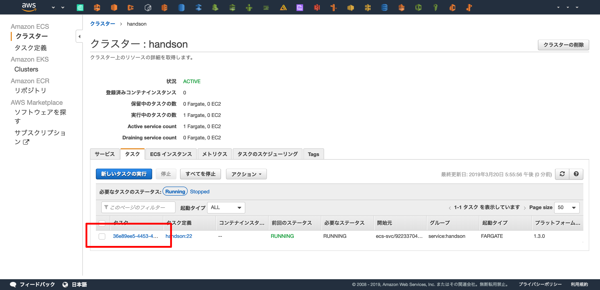
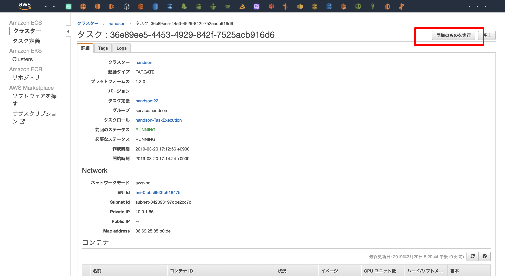
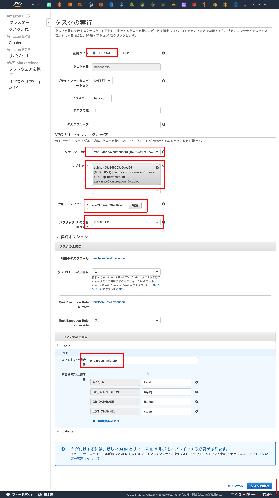
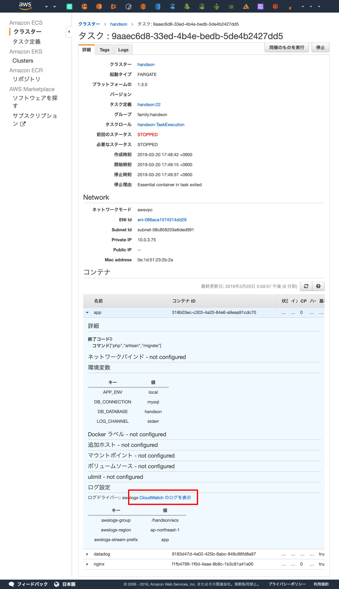
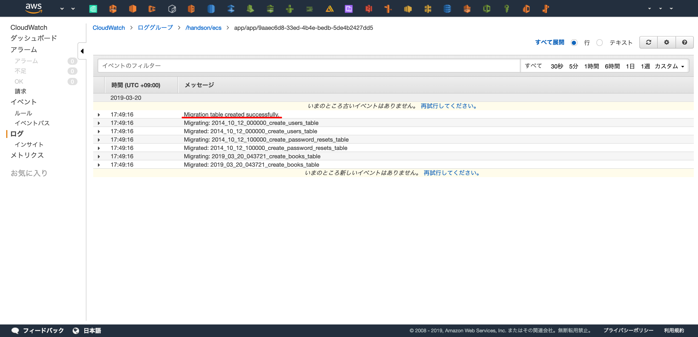

## 概要
LaravelとAurora(MySQL)を連携を行います。

## タスク定義へDB接続情報の追加
`terraform/container_definitions.json` へDBの接続情報を追記します。  
今回データベース名だけ決め打ちしていますが、接続情報は基本的にParameter Store から取得します。

```diff
{
    "name": "app",
    "image": "${account_id}.dkr.ecr.${region}.amazonaws.com/app:${tag}",
    "cpu": 0,
    "memory": 128,
    "logConfiguration": {
        "logDriver": "awslogs",
        "options": {
            "awslogs-region": "${region}",
            "awslogs-group": "/${name}/ecs",
            "awslogs-stream-prefix": "app"
        }
    },
    "secrets": [
        {
            "name": "APP_KEY",
            "valueFrom": "/handson/app/key"
-       }
+       },
+       {
+           "name": "DB_HOST",
+           "valueFrom": "/handson/db/endpoint"
+       },
+       {
+           "name": "DB_USERNAME",
+           "valueFrom": "/handson/db/username"
+       },
+       {
+           "name": "DB_PASSWORD",
+           "valueFrom": "/handson/db/password"
+       }
    ],
    "environment": [
        {
            "name": "APP_ENV",
            "value": "${app_env}"
        },
        {
            "name": "LOG_CHANNEL",
            "value": "stderr"
-       }
+       },
+       {
+           "name": "DB_DATABASE",
+           "value": "handson"
+       },
+       {
+           "name": "DB_DATABASE",
+           "value": "handson"
+       }
    ]
}
```

## Auroraへmigrationの実行
ハンズオンでのワンオフの実行なので、GUIからコマンドを実行します。  

ECSコンソールに入り、起動中のタスクを選択します。  



「同様のものを実行」で起動中のタスクを元に新しいタスクを実行します。



`php artisan migrate` を実行するために、以下の設定を行います。  

1. 起動タイプ: FARGATE
2. クラスターVPC: <ハンズオンで作成したVPC>
3. サブネット: <ハンズオンで作成した **プライベートサブネット** >
4. セキュリティーグループ: <ハンズオンで作成した **ECS Service用のセキュリティーグループ** >
5. パブリックIPの自動割り当て: DISABLE
6. コンテナの上書き
    - コマンドの上書き: `php,artisan,migrate`

入力後、「タスクの実行」を押下します。



migration結果の確認





## 動作確認
```
$ curl <YOUR DNS NAME>/api/books
[]
$ curl -X POST <YOUR DNS NAME>/api/books
{
    "title": "tmp title",
    "updated_at": "2019-03-20 09:34:00",
    "created_at": "2019-03-20 09:34:00",
    "id": 1
}
$ curl -X POST <YOUR DNS NAME>/api/books
{
    "title": "tmp title",
    "updated_at": "2019-03-20 09:34:00",
    "created_at": "2019-03-20 09:34:00",
    "id": 2
}
$ curl <YOUR DNS NAME>/api/books
[
    {
        "id": 1,
        "title": "tmp title",
        "created_at": "2019-03-20 09:33:53",
        "updated_at": "2019-03-20 09:33:53"
    },
    {
        "id": 2,
        "title": "tmp title",
        "created_at": "2019-03-20 09:34:00",
        "updated_at": "2019-03-20 09:34:00"
    }
]
```
