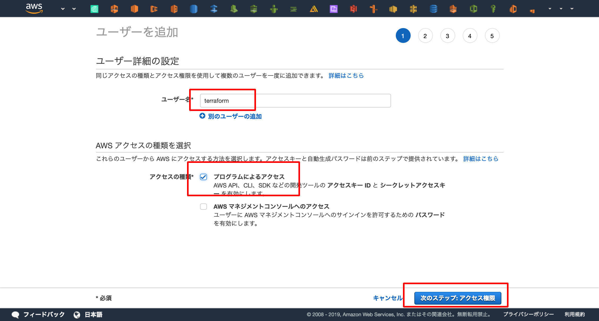
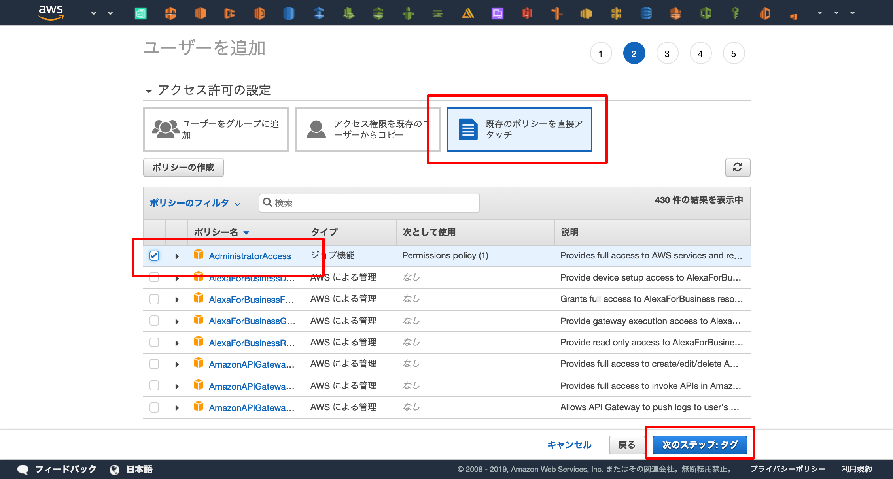
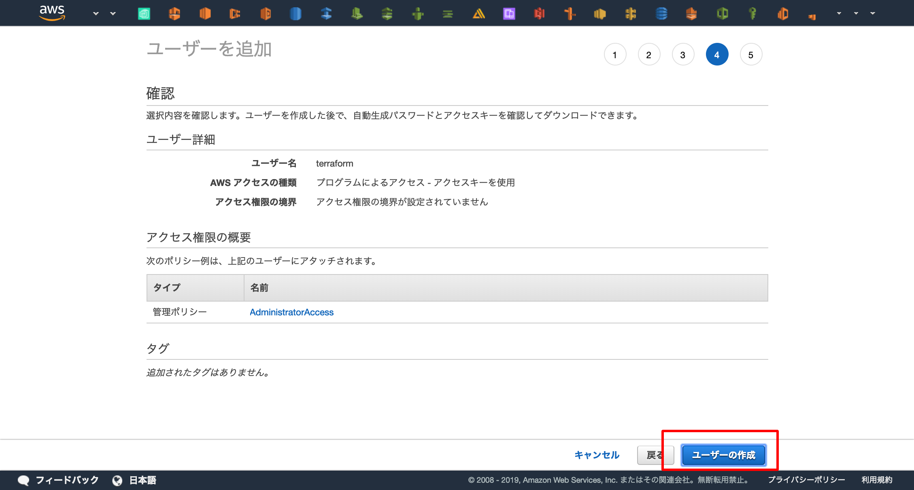
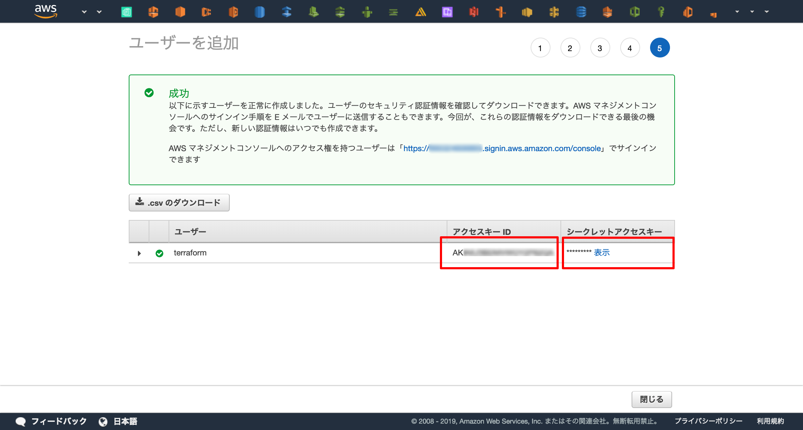

`terraform` コマンドをDockerで用意します。  

## IAMユーザーの作成
まずはAWSのWebコンソールへアクセスしてTerraform実行用のIAMユーザーを作成し、アクセスキーを取得します。


### 手順
AWS WebコンソールからIAMサービスへアクセス  


IAMサービスのトップページからユーザー一覧へアクセス。  


「ユーザーを追加」を選択し、IAMユーザーの作成開始。


ユーザー名を「Terraform」に設定し、「プログラムによるアクセス」を有効化。  
「次のステップ:アクセス権限」を押下。



「既存のポリシーを直接アタッチ」を選択し、「AdministratorAccess」ポリシー(管理者権限)を選択。    
「次のステップ:タグ」を押下。



タグは入力せず、そのまま「次のステップ:確認」を押下。


「ユーザーの作成」を押下し、IAMユーザーの作成が完了。  



アクセスキーを取得できるので、他人にもれないように控える。




!!! シークレットキーをgitへ上げないための保険
    commitの内容をスキャンし、AWSアクセスキーが含まれていたらそのcommitをリジェクトしてくれるツールです。  
    保険のためにもAWSを扱うリポジトリでは有効化しておくと良いでしょう。  

    [awslabs/git-secrets: Prevents you from committing secrets and credentials into git repositories](https://github.com/awslabs/git-secrets)

---
## terraformをDockerで起動
Dockerの1つのユースケースとして「コマンドのラップ」があります。  
ここではDockerに慣れ親しむためにもDockerでTerraformを起動してみます。

まずはディレクトリの作成をしてチェックアウトします (Desktopへ"terraform"というディレクトリを作成していますが、適宜修正してください)。
```
$ mkdir ~/Desktop/terraform
$ cd ~/Desktop/terraform
```

次に、TerraformをDockerで起動します。  
その際に先程取得したIAMユーザーのアクセス情報を渡すことでTerraformがAWSのAPIへアクセスできるようになります。  
また、ホストのカレントディレクトリをコンテナ上へマウント( `-v $(pwd):/templates` )してファイルの共有を行います。
```
$ docker run \
    -e AWS_ACCESS_KEY_ID=<AWS ACCESS KEY> \
    -e AWS_SECRET_ACCESS_KEY=<AWS SECRET ACCESS KEY> \
    -v $(pwd):/templates \
    -w /templates \
    -it \
    --entrypoint=ash \
    hashicorp/terraform:0.11.12
```

これでTerraformの実行環境が手に入りました

---
## 基本的なコマンド
実際にコードを書く前にどんなコマンドがあるか見ておきましょう。  
Terraformは基本的以下の4つのコマンドで操作します。

### `$ terraform init`
初期化。  
コードが依存するプラグインやModuleをダウンロードします。  

`composer install` や `npm install` のようなイメージが近いです。

### `$ terraform plan`
dry-run。  
コードとAWSの環境を比較して、プロビジョニング結果を予測してくれます。  
ただし、例外的なケース(AWSのリソース上限など)はplanからは予測できません。

### `$ terraform apply`
プロビジョニング。  
記述したコードを実際の環境に適用します。


### `$ terraform destroy`
削除。  
管理しているリソースを全て削除します。

