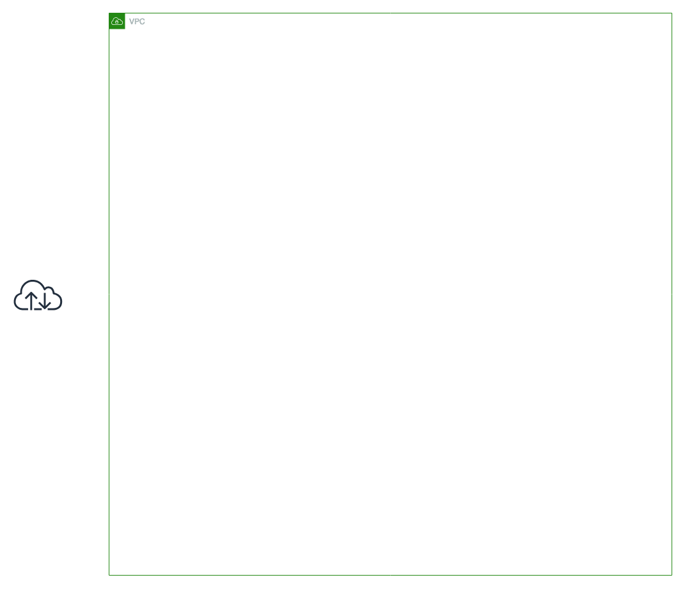
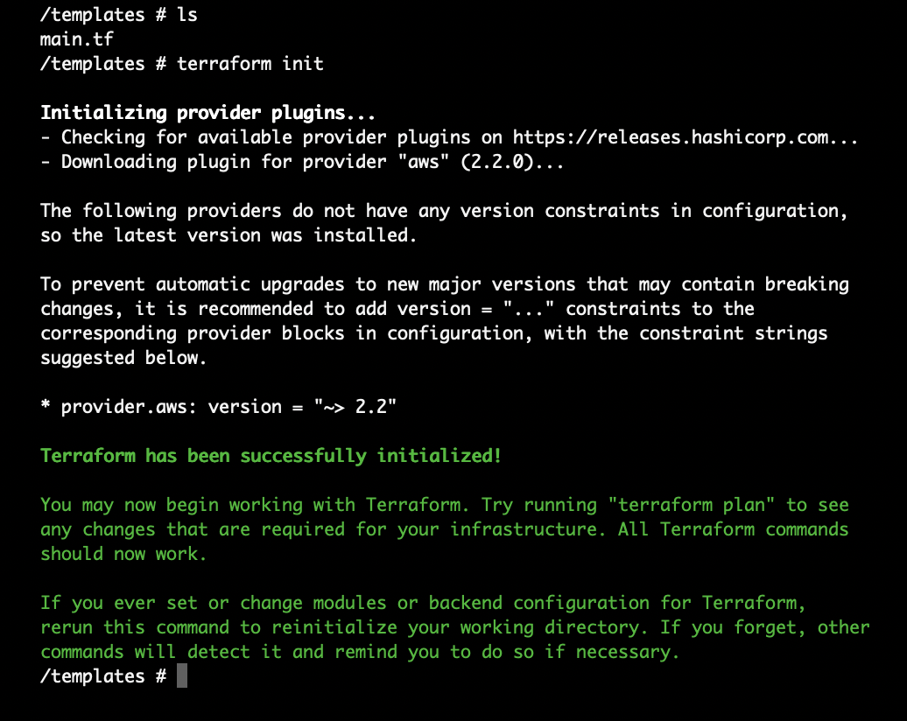
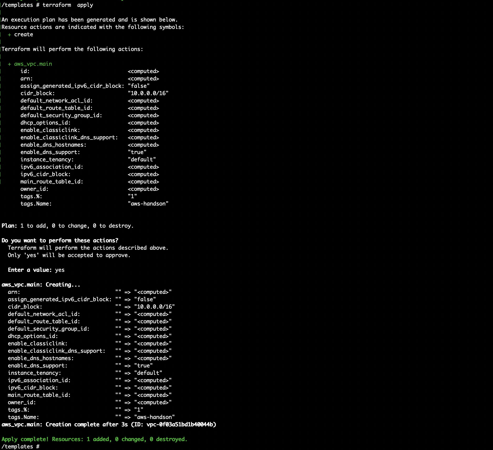
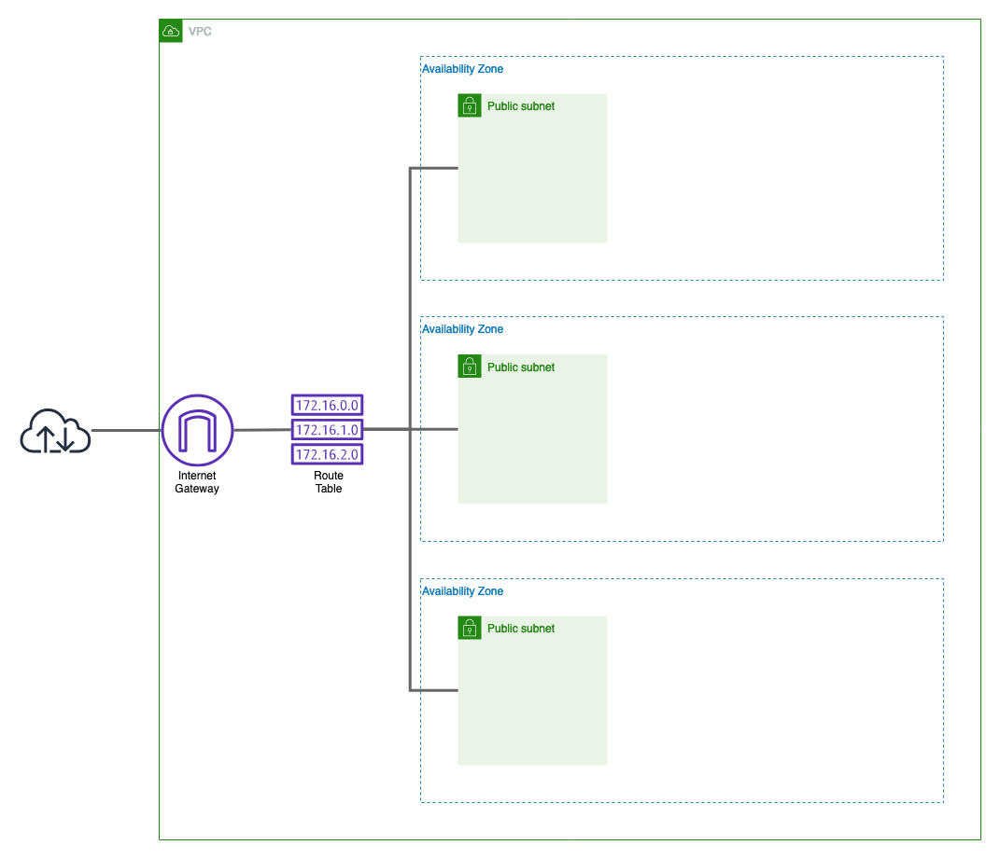
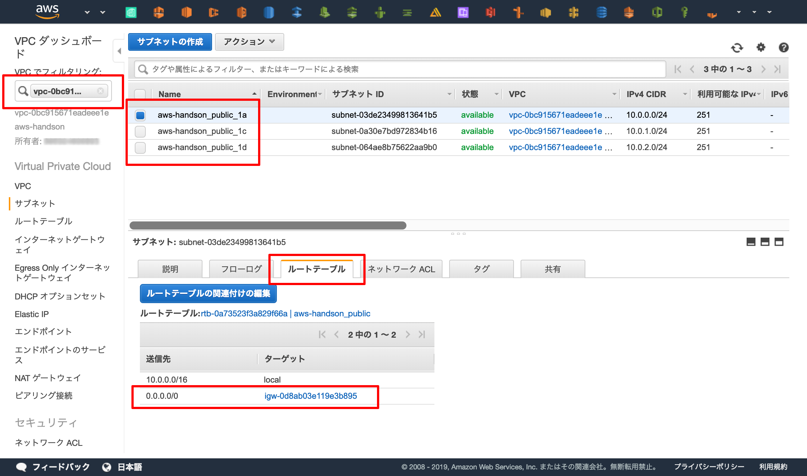
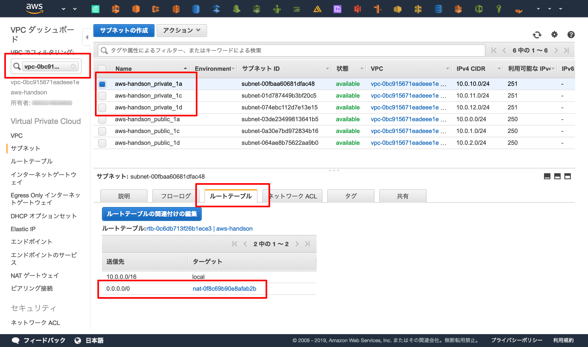
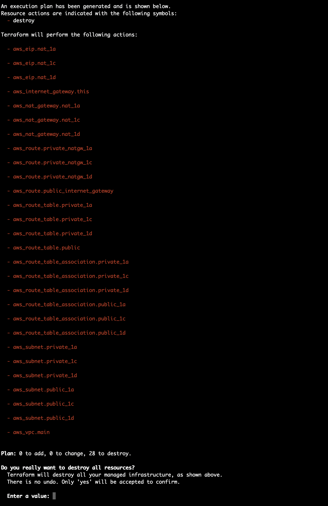

TerraformでVPCを記述する

- provider
- resources

## 概要
AWSのネットワークをTerraformで定義してみましょう。  
具体的に言うと、 `VPC` , `Subnet` , `Route Table` , `Internet Gateway` をTerraformで定義して作成していきます。

## 目標とする環境


一般的に用いられるであろうネットワークです。  
パブリックとプライベートのサブネットを作成して、アベイラビリティゾーン(以下AZ) 3つにサービスを配置できるようサブネットを3つずつ作成します。  
また、NAT Gatewayは1AZに1つしか配置できないため、ディザスタリカバリの観点から単一障害点にならないようにAZの数だけ用意しましょう。


## Terraformで空のVPCを作成する



まずは空のVPCをTerraformで作成してみましょう。

前の章で作成したディレクトリ内で `main.tf` というファイルを作成し、以下の通り記述します。

```ruby
# Providerの設定。
#XXX: AWS Providerを使用してAWSのAPIを有効化し、ap-norheast-1(東京)リージョンへプロビジョニングを実行する
provider "aws" {
  region = "ap-northeast-1"
}

# 変数の宣言
#XXX: 複数回使用する値や、ステージング・本番のように環境によって値が変わるものを変数で宣言する
variable "name" {
  description = "各種リソースの命名"
  default     = "aws-handson"
}

#########################
# VPC
#########################
resource "aws_vpc" "main" {
  cidr_block = "10.0.0.0/16"

  tags = {
    Name = "${var.name}"
  }
}
```

### terraformの初期化
まずは `init` コマンドでTerraformの初期化を行います。  
`init` で依存するプラインなどをローカルへダウンロードします。今回はAWSのAPIを叩くために `AWS Provider` を使用しています。

```
$ terraform init
```



### プロビジョニング
Terraformは非常順でdry-run機能を備えています。  
極めて厳密というわけではありませんが、コードと現在の環境を比較してプロビジョニング結果を予測してくれます。  
プロビジョニングの前に使用すると良いでしょう。  

```
$ terraform plan
```

`plan` が正常終了したら実際にAWSへTerraformでプロビジョニングしてみましょう。  

```
$ terraform apply
```



!!! warning "エラーが起きる場合"
    - `terraform` コマンドを実行するディレクトリはあっていますか？
    - コードはあっていますか？
    - IAMのアクセスキー・権限は正しいですか？
    - AWSのリソース上限に達していませんか？

### Webコンソールで確認
実際にAWSのWebコンソールへアクセスし、 `aws-handson` とい名前のVPCが作成されたか確認してみましょう。

[https://ap-northeast-1.console.aws.amazon.com/vpc/home?region=ap-northeast-1](https://ap-northeast-1.console.aws.amazon.com/vpc/home?region=ap-northeast-1)


## パブリックサブネットを作成



AWSのSLAは「リージョン使用不可」の状態になった時間を定義しています。  
そのため、AZはSLAを享受するためにリージョン内のAZ全てに配置する必要ができます。  
気になる方は [AWSの公式](https://aws.amazon.com/jp/legal/service-level-agreements/) で確認してみてください。

東京(ap-norheast-1)リージョンの場合は現在(2019/03)3つのAZが存在するため、各サービスが3AZにまたがって配置できるように **サブネットを3つ** 作成します。  
そのあと、インターネットと接続できるよう **"Internet Gateway"** を作成し、そのInternet Gateway を各サブネットが使用できるよう **"Route Table"** でルーティングを設定します。  
このようにInternet Gatewayとつながっているサブネットのことを **パブリックサブネット** と呼びます。逆にInternet Gateway とつながっていないサブネットのことはプライベートサブネットと呼びます。

### `main.tf` へ追記
以下のコードを `main.tf` へ追記します。

```ruby
#########################
# Public Subnet
#########################
# Internet Gateway
resource "aws_internet_gateway" "this" {
  vpc_id = "${aws_vpc.main.id}" # 上記の `resource "aws_vpc" "main"` が作成したVPCのIDを取得

  tags = {
    Name = "${var.name}"
  }
}

# Route Table
resource "aws_route_table" "public" {
  vpc_id = "${aws_vpc.main.id}"

  tags = {
    Name = "${var.name}_public"
  }
}

resource "aws_route" "public_internet_gateway" {
  route_table_id         = "${aws_route_table.public.id}"
  destination_cidr_block = "0.0.0.0/0"
  gateway_id             = "${aws_internet_gateway.this.id}"
}

# Public Subnet
resource "aws_subnet" "public_1a" {
  vpc_id = "${aws_vpc.main.id}"

  cidr_block        = "10.0.0.0/24"
  availability_zone = "ap-northeast-1a"

  tags = {
    Name = "${var.name}_public_1a"
  }
}

resource "aws_route_table_association" "public_1a" {
  subnet_id      = "${aws_subnet.public_1a.id}"
  route_table_id = "${aws_route_table.public.id}"
}

resource "aws_subnet" "public_1c" {
  vpc_id = "${aws_vpc.main.id}"

  cidr_block        = "10.0.1.0/24"
  availability_zone = "ap-northeast-1c"

  tags = {
    Name = "${var.name}_public_1c"
  }
}

resource "aws_route_table_association" "public_1c" {
  subnet_id      = "${aws_subnet.public_1c.id}"
  route_table_id = "${aws_route_table.public.id}"
}

resource "aws_subnet" "public_1d" {
  vpc_id = "${aws_vpc.main.id}"

  cidr_block        = "10.0.2.0/24"
  availability_zone = "ap-northeast-1d"

  tags = {
    Name = "${var.name}_public_1d"
  }
}

resource "aws_route_table_association" "public_1d" {
  subnet_id      = "${aws_subnet.public_1d.id}"
  route_table_id = "${aws_route_table.public.id}"
}
```

!!! note "Don't Repeat Yourself"
    繰り返し処理が多いですね。  
    Terraformではプログラミング言語でいう `for` のようなループして実行するための機能があります。  
    今回のPublic Subnet はまさに繰り返し処理が生きる箇所なので、余裕のある方はリファクタしてみると良いでしょう。
    
    [Interpolation Syntax - 0.11 Configuration Language - Terraform by HashiCorp](https://www.terraform.io/docs/configuration-0-11/interpolation.html#using-templates-with-count)
    


### プロビジョニングの実行と確認

`plan` コマンドでコードに問題がないこを確認します。  
このときにTerraformはAWSの環境との差分を比較し、どのリソースを作成するか表示してくれます。  
VPCは作成されず、Internet Gateway, Route Table , Public Subnet x3 , Route x4 、の計 **9つのリソース** が新しく追加されることを確認してください。

```
$ terraform plan
```


問題がないことを確認できたらプロビジョニングを実行します

```
$ terraform apply
```

パブリックサブネットが作成されたかをWebコンソールで確認します。  
サイドメニューの「VPCでフィルタリング」でVPCを選択すると、選択したVPC内のリソースだけ表示されるようになります。

1. 3つSubnetが作成できているか
    - `aws-handson_public_1a` , `aws-handson_public_1c` , `aws-handson_public_1d`
2. SubnetとInternet Gateway が紐付いているか
    - "サブネットを選択" > "ルートテーブル" > 送信先が0.0.0.0、ターゲットがInternet Gateway ( `igw-` から始まるターゲット)



## プライベートサブネットとNAT Gatewayの作成


最後にプライベートサブネットとNAT Gatewayを作成しましょう。

### `main.tf` へ追記

```ruby
#########################
# Private Subnet
#########################
# Route Table
resource "aws_route_table" "private_1a" {
  vpc_id = "${aws_vpc.main.id}"

  tags = {
    Name = "${var.name}"
  }
}

resource "aws_route_table" "private_1c" {
  vpc_id = "${aws_vpc.main.id}"

  tags = {
    Name = "${var.name}"
  }
}

resource "aws_route_table" "private_1d" {
  vpc_id = "${aws_vpc.main.id}"

  tags = {
    Name = "${var.name}"
  }
}

# NAT Gateway
resource "aws_eip" "nat_1a" {
  vpc = true

  tags = {
    Name = "${var.name}_1a"
  }
}

resource "aws_eip" "nat_1c" {
  vpc = true

  tags = {
    Name = "${var.name}_1a"
  }
}

resource "aws_eip" "nat_1d" {
  vpc = true

  tags = {
    Name = "${var.name}_1a"
  }
}

resource "aws_nat_gateway" "nat_1a" {
  allocation_id = "${aws_eip.nat_1a.id}"
  subnet_id     = "${aws_subnet.public_1a.id}"

  tags = {
    Name = "${var.name}_1a"
  }
}

resource "aws_route" "private_natgw_1a" {
  route_table_id         = "${aws_route_table.private_1a.id}"
  destination_cidr_block = "0.0.0.0/0"
  nat_gateway_id         = "${aws_nat_gateway.nat_1a.id}"
}

resource "aws_nat_gateway" "nat_1c" {
  allocation_id = "${aws_eip.nat_1c.id}"
  subnet_id     = "${aws_subnet.public_1c.id}"

  tags = {
    Name = "${var.name}_1c"
  }
}

resource "aws_route" "private_natgw_1c" {
  route_table_id         = "${aws_route_table.private_1c.id}"
  destination_cidr_block = "0.0.0.0/0"
  nat_gateway_id         = "${aws_nat_gateway.nat_1c.id}"
}

resource "aws_nat_gateway" "nat_1d" {
  allocation_id = "${aws_eip.nat_1d.id}"
  subnet_id     = "${aws_subnet.public_1d.id}"

  tags = {
    Name = "${var.name}_1d"
  }
}

resource "aws_route" "private_natgw_1d" {
  route_table_id         = "${aws_route_table.private_1d.id}"
  destination_cidr_block = "0.0.0.0/0"
  nat_gateway_id         = "${aws_nat_gateway.nat_1d.id}"
}

# Private Subnet
resource "aws_subnet" "private_1a" {
  vpc_id = "${aws_vpc.main.id}"

  cidr_block        = "10.0.10.0/24"
  availability_zone = "ap-northeast-1a"

  tags = {
    Name = "${var.name}_private_1a"
  }
}

resource "aws_route_table_association" "private_1a" {
  subnet_id      = "${aws_subnet.private_1a.id}"
  route_table_id = "${aws_route_table.private_1a.id}"
}

resource "aws_subnet" "private_1c" {
  vpc_id = "${aws_vpc.main.id}"

  cidr_block        = "10.0.11.0/24"
  availability_zone = "ap-northeast-1c"

  tags = {
    Name = "${var.name}_private_1c"
  }
}

resource "aws_route_table_association" "private_1c" {
  subnet_id      = "${aws_subnet.private_1c.id}"
  route_table_id = "${aws_route_table.private_1c.id}"
}

resource "aws_subnet" "private_1d" {
  vpc_id = "${aws_vpc.main.id}"

  cidr_block        = "10.0.12.0/24"
  availability_zone = "ap-northeast-1d"

  tags = {
    Name = "${var.name}_private_1d"
  }
}

resource "aws_route_table_association" "private_1d" {
  subnet_id      = "${aws_subnet.private_1d.id}"
  route_table_id = "${aws_route_table.private_1d.id}"
}
```


### プロビジョニングの実行と確認

いつもどおり `plan` と `apply` でプロビジョニングを行います。

```
$ terraform plan
$ terraform apply
```


1. 3つPrivate Subnetが作成できているか
    - `aws-handson_private_1a` , `aws-handson_private_1c` , `aws-handson_private_1d`
2. SubnetとNAT Gateway が紐付いているか
    - "サブネットを選択" > "ルートテーブル" > 送信先が0.0.0.0、ターゲットがNAT Gateway ( `nat-` から始まるターゲット)



## 削除
`destroy` コマンドでリソースを全て削除します。
```
$ terraform destroy
```



リソースの削除後、 `terraform apply` を実行しても同じ環境ができることを確認するのも良いかも知れません。

## まとめ
- `main.tf` に必要なリソースをコードで記述する
    - コードはリファレンスを読んでAPIを確認しながら書く。
    - [Provider: AWS - Terraform by HashiCorp](https://www.terraform.io/docs/providers/aws/index.html)
- コマンドはシンプル
    - `terraform init` で初期化
    - `terraform plan` でdry-run
    - `terraform apply` でプロビジョニング
    - `terraform destroy` で削除
